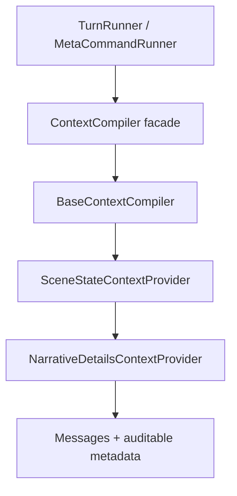

# Explicit Context Pipeline

## Статус

Это первый этап снятия runtime monkeypatch-слоёв. Он заменяет два глобальных guard:

- `scene_context_guard.py`;
- `memory_context_guard.py`.

Остальные global guards пока сохраняются и будут разобраны отдельными PR.

## Композиция



Порядок provider является обычным значением конструктора и проверяется тестом. Он больше
не зависит от того, какой Python-модуль импортировали первым.

## Ответственность компонентов

### `BaseContextCompiler`

Сохраняет прежнюю сборку:

- system/session-zero contract;
- текущую сцену и active theses;
- карточки персонажей;
- факты и beliefs;
- историю;
- token budget и manifest базовых слоёв.

Файл перенесён из прежнего `context_compiler.py` без изменения содержимого.

### `SceneStateContextProvider`

Добавляет:

- authoritative location и location path;
- world time;
- participant/object IDs;
- доступные exits и destinations;
- scene invariant errors;
- Scene Bridge для целевой сцены.

### `NarrativeDetailsContextProvider`

Добавляет краткоживущую фактуру сцены с прежними ограничениями token budget и visibility.
Эти сведения явно помечаются как transient/non-canon.

## Совместимость

Публичный импорт не изменился:

```python
from app.services.context_compiler import ContextCompiler, count_tokens
```

Поэтому `TurnRunner`, `/DM`, тесты и будущие адаптеры получают явный pipeline без массовой
перепривязки импортов.

## Runtime manifest

`runtime_manifest()` теперь разделяет:

- `guards`: оставшиеся глобальные monkeypatch guards;
- `context_pipeline`: явные ordered providers.

Ожидаемое состояние после этого этапа:

```text
guards:
  - narration_validation
  - memory_scribe
  - thesis_lifecycle

context_pipeline:
  - authoritative_scene_state
  - recent_narrative_details
```

## Следующий этап

Следующим отдельным PR следует убрать глобальную подмену `LLMProvider.generate_stream` и
`TurnRunner.run_turn_stream`, заменив её явным `NarrationGenerationPipeline` с этапами:

1. generate draft;
2. validate;
3. repair;
4. publish accepted text.
