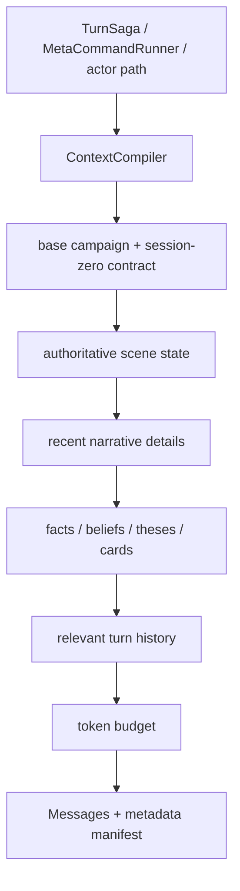

# Context Pipeline

## Статус

Текущий production overview. Исторические этапы снятия старых monkeypatch guards доступны в git history.

`ContextCompiler` собирает ограниченный, auditable prompt для конкретной роли/хода. Он не меняет состояние мира.

## Основная композиция



`runtime_manifest().context_pipeline` является машинно-проверяемым списком ordered providers текущей сборки.

## Authoritative scene state

Scene provider добавляет данные, которые Narrator не должен угадывать из prose:

- current Scene;
- Scene → Location binding и location path;
- world time;
- physically present participant/object IDs;
- available exits/destinations;
- scene invariant errors;
- scene bridge/negative placement, когда применимо.

Если prose прошлых ходов спорит с authoritative scene state, для нового turn приоритет имеет structured state.

## Memory layers

Контекст может включать:

- active scene theses;
- character cards/equipment;
- facts;
- actor-scoped beliefs;
- relationships;
- recent narrative details;
- recent history.

Ключевой принцип actor-scoped context: private knowledge другого NPC не передаётся выбранному speaker просто потому, что оно существует в общей кампании.

## Narrative detail

`narrative_detail` — transient scene texture. Она помогает continuity нескольких ближайших ходов, но не является вечным каноном.

Это позволяет помнить, например, что свеча только что погасла или персонаж стоит у окна, не превращая каждую художественную деталь в permanent fact.

## Token budget

Context Compiler обязан оставлять completion reserve и safety margin.

Для обычного Narrator turn после P0 recovery Planner reserve **не вычитается повторно**, потому что Planner уже завершил отдельный structured call.

При default 4096 context window Narrator budget рассчитывается примерно как:

```text
4096
- 1536 response reserve
- 5% safety margin
≈ 2356 context tokens
```

Metadata помечает этот режим:

```text
planner_reserve_removed_from_narrator_budget=true
final_narrator_context_budget=<value>
```

Actor/control paths могут иметь другой budget contract.

## Typed authority injection

После Planner/execution `TurnSaga` добавляет Narrator не полный audit state, а compact typed render contract.

Compact payload содержит только необходимые для prose поля, например:

- exact player input;
- player/acting character;
- source/target location;
- present/known-absent characters;
- allowed new NPCs;
- resolution/observable consequences;
- compact action steps;
- narration guidance.

Полный `TurnAuthority` остаётся persisted evidence, но маленькая creative model не должна тратить context на ненужные audit fields.

## Manifest

Context metadata нужен не только тестам. Он должен позволять ответить:

- какая Scene была authoritative;
- какой actor был выбран;
- какие memory layers были включены/исключены;
- какие IDs реально попали в prompt;
- какой budget был доступен;
- были ли invariant warnings.

Именно manifest следует проверять при подозрении на «Narrator забыл факт», прежде чем считать проблему model hallucination.

## `/DM`

`MetaCommandRunner` также использует ContextCompiler, но meta channel read-only. Snapshot передаётся модели как данные, а не как разрешение менять мир.

Важно: debug transparency не означает, что raw authoritative snapshot должен печататься игроку. Player-facing meta response нуждается в отдельной output boundary/sanitization policy.

## Инварианты

- compiler не выполняет `commit` world-state изменений;
- provider order не зависит от случайного import order;
- Scene state не выводится только из prose history;
- actor-scoped private memory фильтруется до LLM;
- current user message не должен случайно выпадать при budget trimming;
- final manifest сохраняет достаточно evidence для диагностики.

См. также [`../runtime-transparency.md`](../runtime-transparency.md).
