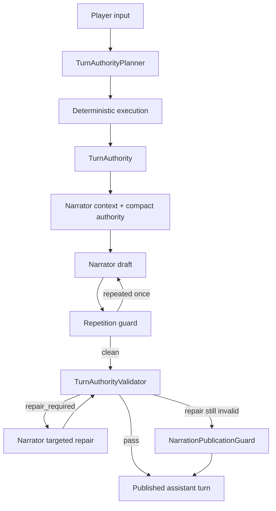

# Narration Publication Pipeline

## Статус

Текущий production contract. Narrator является renderer уже утверждённого `TurnAuthority`; он не владеет исходом хода.

## Композиция



`AuthorityNarrationPipeline` полностью буферизует художественный кандидат до publication. Пользователь не должен видеть raw draft, который затем был признан нарушающим authority.

## Этапы

### 1. `generate_draft`

Campaign Narrator генерирует complete candidate prose. Genuine output truncation допускает одну continuation попытку с хвостом уже сгенерированного текста.

### 2. `guard_repetition`

Candidate сравнивается с недавними published responses текущей сцены. Near-verbatim повтор вызывает одну regeneration попытку. Persisted repetition переводит turn в deterministic presentation fallback.

### 3. deterministic player-agency check

В Validator contract дополнительно встраивается deterministic check живых регрессий:

- direct player speech не может быть переатрибутирована NPC/миру;
- Narrator не может добавлять новое добровольное действие, решение, мысль или эмоцию protagonist, если соответствующего действия нет в `player_input`.

Это не заменяет semantic Validator, а закрывает ошибки, которые не следует оставлять на probabilistic judgement модели.

### 4. `validate_authority`

Control model (`NARRATION_VALIDATOR`, default Qwen) получает compact typed authority и candidate prose.

Validator проверяет:

- player agency;
- physical presence characters/objects;
- movement and exits;
- world-time advance;
- blocked/skipped sequence steps;
- ungrounded complications;
- explicit canon conflicts.

Он **не переписывает state** и не выбирает другой исход.

### 5. `repair_once`

Если verdict `repair_required`, тот же Narrator получает targeted repair prompt с точными violations и rejected candidate. Repair затем проходит Validator повторно.

### 6. deterministic presentation containment

Если Narrator/Validator не смогли получить безопасный художественный текст, `NarrationPublicationGuard` строит player-facing projection уже выполненного authority.

Это сознательный degraded mode: state сохраняется, но prose quality считается failed.

После P0 Narrator recovery fallback не должен публиковать «Пока ничего заметно не меняется», если authority доказывает уже состоявшийся movement или completed observation.

## Validation statuses

В live diagnostics важно различать:

- `passed` — raw draft принят без repair;
- `repaired` — был repair или deterministic presentation recovery;
- `failed_open` — Validator был недоступен/сломался, после чего publication guard применил свою policy;
- `safe_fallback` — pipeline явно вернул deterministic authority projection;
- `not_invoked` — validation path не был использован для данного типа turn.

Название `failed_open` историческое и не означает «показать сырой draft любой ценой». Publication guard всё равно обязан защищать authority.

## Persisted audit

`NarrationValidator.start_run()` сохраняет `NarrationValidationRun` до проверки. В БД остаются:

- original `draft_text`;
- validator model;
- каждый `candidate_text`;
- verdict;
- summary;
- violations;
- validator telemetry;
- final text;
- repair count;
- failure reason.

То есть raw-vs-repair evidence **уже существует durable**, даже если текущий debugger API показывает его не полностью.

## Telemetry в assistant turn

`turn.context_snapshot.provider_telemetry` содержит Narrator/provider telemetry и вложенный `narration_validation` audit summary. Playtest trace использует это для model name, validation status, repetition guard и latency diagnostics.

## Что не должен делать Narrator pipeline

- менять `Scene`, `Location`, participant set или player location;
- материализовывать NPC, которого нет в `allowed_new_npcs`;
- менять Planner resolution;
- превращать failed repair в новый сюжетный исход;
- исправлять memory post factum так, чтобы published turn выглядел истинным;
- скрывать degraded publication под статусом normal model prose.

## Runtime manifest

Текущий `runtime_manifest()` описывает narration pipeline как:

```text
generate_draft
→ guard_repetition
→ validate_authority
→ repair_once
→ guard_repetition
→ contain_presentation_failure
→ publish_accepted
```

Оставшиеся compatibility guards перечисляются отдельно в `runtime_manifest().guards`; они не должны замалчиваться в архитектурной документации.

## Quality acceptance

Authority correctness недостаточна для playable RPG. Live Narrator tests дополнительно оценивают:

- локальную и глобальную связность;
- continuity с предыдущими ходами;
- художественную конкретность;
- атмосферу без generic purple prose;
- вариативность языка;
- естественность русского текста;
- драматургическую функцию;
- количество `safe_fallback` и repairs.

Raw draft и published response следует оценивать отдельно, чтобы не обвинять Narrator в деградации, созданной Validator/repair/publication pipeline.
