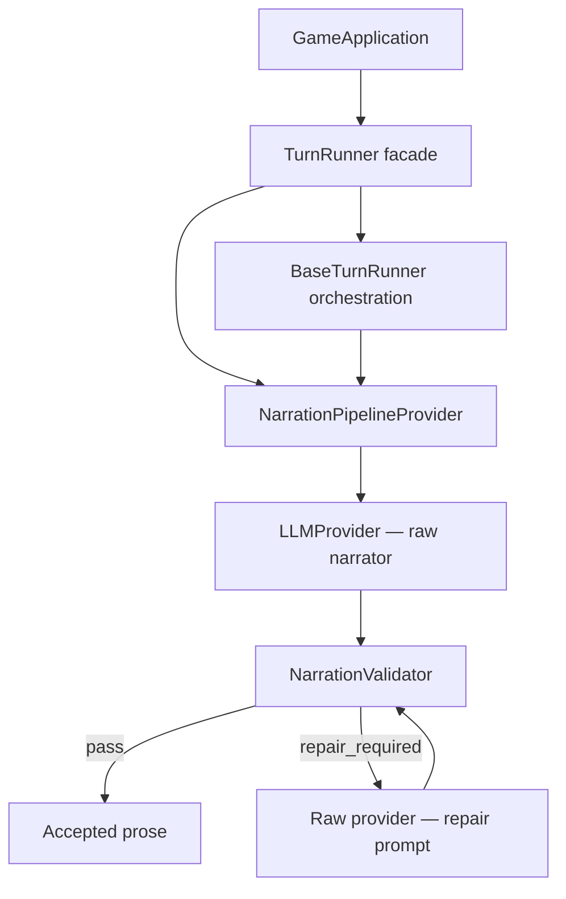

# Explicit Narration Pipeline

## Статус

Это второй этап снятия runtime monkeypatch-слоёв. Он удаляет глобальные подмены:

- `TurnRunner.run_turn_stream`;
- `LLMProvider.generate_stream`.

После этого PR обычный `LLMProvider` остаётся сырой инфраструктурой моделей, а проверка
художественной прозы подключается только к narrative turn через явную зависимость.

## Композиция



## Этапы

1. `generate_draft` — сырой narrator output полностью буферизуется;
2. `validate` — отдельная validator-role проверяет continuity, placement и agency;
3. `repair` — при нарушениях сырой narrator получает точный repair prompt;
4. `publish_accepted` — наружу отдаётся только принятый текст.

## Важные границы

- `NarrationPipelineProvider` создаётся внутри публичного `TurnRunner`;
- контекст кампании и trigger turn хранится в экземпляре provider на время одного вызова;
- нет `ContextVar`, глобального `_ORIGINAL_GENERATE_STREAM` или зависимости от import order;
- Planner, Session Zero, Memory Scribe, Curator и `/DM` используют обычные model providers;
- retry и truncated continuation остаются ответственностью базового turn orchestrator;
- validation audit и repair attempts сохраняются в прежних таблицах.

## Совместимость

Прежний большой turn orchestrator перенесён без изменения содержимого в
`base_turn_runner.py`. Публичный импорт не меняется:

```python
from app.services.turn_runner import TurnRunner
```

Поэтому `GameApplication`, FastAPI, CLI и будущий frontend продолжают использовать один
и тот же класс, но его composition теперь видна обычным Python-кодом.

## Runtime manifest после этапа

```text
guards:
  - memory_scribe
  - thesis_lifecycle

narration_pipeline:
  - generate_draft
  - validate
  - repair
  - publish_accepted
```

`runtime_manifest()` отдельно доказывает, что:

- `LLMProvider.generate_stream` не заменён;
- `BaseTurnRunner.run_turn_stream` не заменён;
- публичный `TurnRunner` явно оборачивает базовый orchestrator;
- CLI и FastAPI получают одинаковую композицию.

## Следующий этап

После живого CLI-прогона можно переходить к транзакционной границе:

1. определить владельца commit/rollback игрового хода;
2. отделить durable post-turn jobs от основной turn transaction;
3. затем разделить `BaseTurnRunner` на явные стадии Turn Saga.
