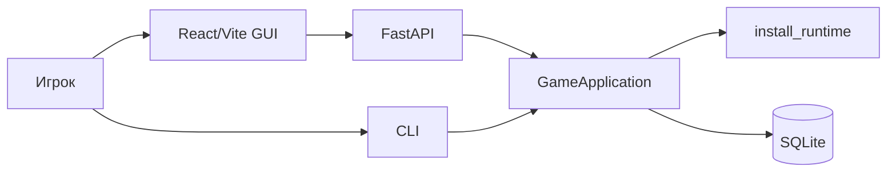
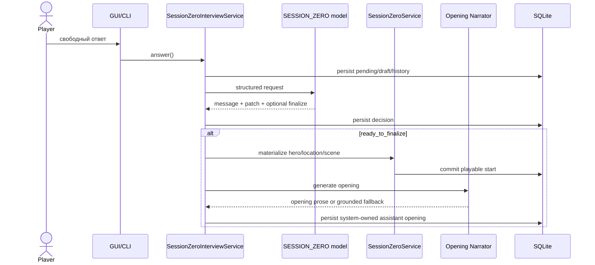
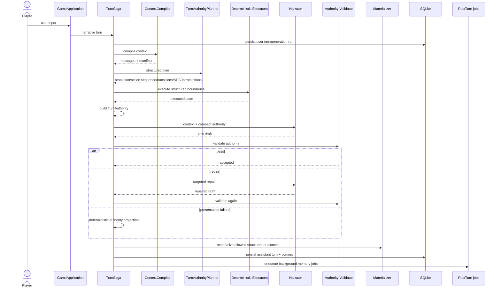

# Personal DM: текущая runtime-архитектура

**Статус:** current production overview  
**Дата:** 24 августа 2026

Этот документ описывает текущий runtime крупными блоками. Детальная причинная карта и observability gaps находятся в [`../runtime-transparency.md`](../runtime-transparency.md).

## 1. Клиенты и application boundary

React/Vite GUI и CLI используют один `GameApplication` и один runtime. FastAPI — production adapter для GUI, а не отдельная версия движка.



Клиент не должен сам менять Scene/Location/participants или обходить use-case boundary.

## 2. Runtime bootstrap

`app.runtime.install_runtime()` устанавливает оставшиеся compatibility guards ровно один раз.

Текущий список берётся из `runtime_manifest().guards` и на момент этой версии включает:

```text
actor_turn_authority
actor_memory_observability
systemless_authority
round33_identity
round34_live
mixed_actor_response
memory_scribe
narrator_quality_recovery
narration_failure_containment
session_zero_finalize
thesis_lifecycle
```

Часть архитектуры уже является явной composition (`ContextCompiler`, `TurnSaga`, `AuthorityNarrationPipeline`), но guard proliferation остаётся техническим долгом. Документация не должна делать вид, что этих monkeypatch boundaries нет.

## 3. Session Zero

Session Zero — свободный разговор с primary model, которая возвращает structured decision/patch через schema-constrained вызов.



### Handoff invariants

- final Session Zero reply не задаёт новый вопрос;
- narrative turn запрещён до completed setup;
- opening создаётся автоматически;
- opening имеет `parent_turn_id=null` и привязан к первой Scene;
- repeated finalize не создаёт duplicate opening;
- visual generation после setup best-effort и не блокирует playable state.

## 4. Input routing

`GameApplication.route_input()` различает:

- narrative action/dialogue;
- `/DM` / `/OOC` meta channel;
- actor-scoped talk mode.

Meta path read-only и не запускает normal Planner/scene transition/memory mutation pipeline.

## 5. Narrative Turn Saga



## 6. TurnAuthority

Один typed `TurnAuthority` — handoff между semantic control plane и presentation layer.

Он содержит enough evidence для Narrator/Validator:

- exact player input;
- player/acting character identity;
- scene disposition;
- source/target location;
- present/known-absent characters;
- allowed new NPC introductions;
- action sequence;
- resolution/observable consequences;
- narration constraints/guidance.

### Ownership

| Concern | Owner |
|---|---|
| voluntary protagonist action/dialogue | human player |
| intended resolution | Planner |
| movement/Scene/Location | deterministic executors |
| participant set | Scene state |
| allowed new NPC | Planner + deterministic materializer |
| prose/style | Narrator |
| prose acceptance/repair | Validator + deterministic guards |
| long-term memory extraction | post-turn pipeline |

## 7. ContextCompiler

Compiler собирает:

- system/session-zero contract;
- authoritative Scene/Location/time/participants/exits;
- active theses;
- actor-scoped cards/facts/beliefs/relationships;
- transient narrative details;
- relevant history;
- current input;
- auditable token-budget metadata.

Narrator получает compact authority after planning; полный audit object остаётся persisted evidence.

Подробности: [`context-pipeline.md`](context-pipeline.md).

## 8. Narration pipeline

```text
generate draft
→ repetition guard
→ deterministic agency checks
→ authority validator
→ optional targeted repair
→ second validation
→ deterministic presentation containment if needed
→ publish
```

Narrator не должен:

- добавлять voluntary protagonist action/thought/emotion;
- повторять direct player speech как чужую реплику;
- перемещать персонажей вне structured transition;
- создавать незапланированного физического NPC;
- превращать blocked step в completed;
- менять outcome после Validator reject.

`safe_fallback` является degraded presentation, а не успешной prose generation.

Подробности: [`narration-pipeline.md`](narration-pipeline.md).

## 9. Scene / Location

Scene != Location.

Scene хранит активный драматический контекст и participants. Location — физическое место/иерархия мест.

Инварианты:

- у campaign одна authoritative current Scene;
- current Scene связана с Location;
- player `current_location_id` совпадает с active Scene Location;
- movement проходит через structured transition;
- return/revisit разрешается по known/visited route identity;
- реальная неоднозначность fail-closed;
- NPC не телепортируется между Scene без authority.

## 10. NPC и actor turns

Actor-scoped turn использует выбранного physically-present NPC.

Его контекст ограничен доступными ему знаниями. Объективный truth не должен выводиться из одной NPC speech только потому, что Scribe увидел предложение в тексте.

New NPC protocol:

1. Planner/normalizer создаёт typed introduction;
2. authority разрешает introduction;
3. Narrator может его отрендерить;
4. deterministic materializer создаёт entity и participant state.

Generic contact может закончиться либо typed responder, либо explicit no-contact. «Кто-то ответил в prose, но entity не существует» — invalid state.

## 11. Post-turn memory

После accepted/persisted narrative turn создаются durable background jobs.

Типичный путь:

```text
assistant turn
→ Entity Registrar (legacy/background extraction where applicable)
→ Memory Scribe
→ deterministic validation/taxonomy
→ proposals / facts / beliefs / relationships / events
→ Thesis Curator / lifecycle
```

Memory failure не должен отменять уже опубликованный turn.

## 12. Undo

Undo должен работать по связанной user/assistant pair и восстанавливать structured consequences, а не только скрывать chat rows.

Особенно важно восстанавливать:

- active Scene;
- player Location;
- transition/bridge state;
- action-sequence-owned effects.

## 13. Models

Default local split:

```text
campaign primary: gemma4:e4b
control: qwen2.5:7b
```

Primary: Narrator, Session Zero, `/DM`, Character Builder without override.

Control: Planner, Narration Validator, Entity Registrar, Scribe, Curator, Evaluator, simulation Player, Scenario Builder, structured repair.

Control roles strict: schema/provider failure не должен скрыто превращать Gemma в Planner/Validator.

## 14. Visual runtime

ComfyUI visual generation — отдельный best-effort layer.

Поддерживаются:

- character portrait;
- campaign cover;
- scene image.

Session Zero может фоново запланировать portrait/cover. Scene generation доступна из Play UI. GPU/ComfyUI failure не меняет campaign truth.

## 15. Debugging

Основные endpoints:

```text
GET /api/campaigns/{id}/debugger
GET /api/campaigns/{id}/debugger/turns/{assistant_turn_id}
GET /api/campaigns/{id}/debugger/trace
GET /api/debugger
```

Per-turn causal order:

```text
input
→ route/actor
→ Planner
→ execution
→ TurnAuthority
→ raw Narrator
→ validation/repair
→ publication
→ materialization
→ Scene/Location state
→ memory jobs
```

При расследовании фиксируются отдельно:

- first wrong boundary;
- cascade;
- player-visible symptom.

## 16. Известный technical debt

1. compatibility guards всё ещё меняют public extension points; их следует постепенно складывать обратно в явных owners;
2. raw `NarrationValidationRun` audit не полностью представлен в playtest trace;
3. `runtime_manifest()` пока неудобно читать из работающего GUI через API;
4. per-turn token budget breakdown разнесён между context metadata и provider telemetry;
5. `/DM` нуждается в отдельной player-facing sanitization boundary, чтобы debug snapshot никогда не становился prompt leakage;
6. prose-quality benchmark пока является live-test дисциплиной, а не persisted runtime metric.

Эти gaps подробно перечислены в [`../runtime-transparency.md`](../runtime-transparency.md).

## 17. Runtime parity

CLI, FastAPI/GUI и test harness должны получать одинаковую production composition.

`runtime_manifest()` служит auditable fingerprint:

- guards;
- context pipeline;
- turn pipeline;
- narration pipeline;
- implementation identities;
- post-turn mode.

Parity tests должны падать, если один entrypoint случайно запускает другой pipeline.
