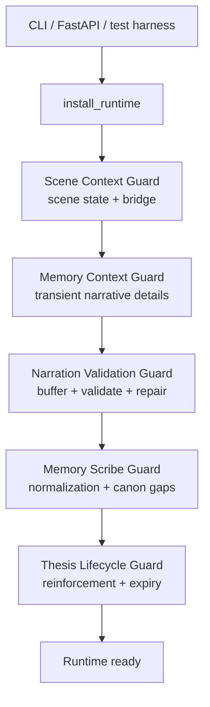
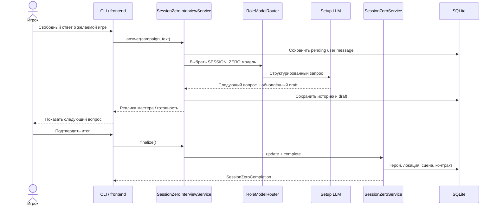
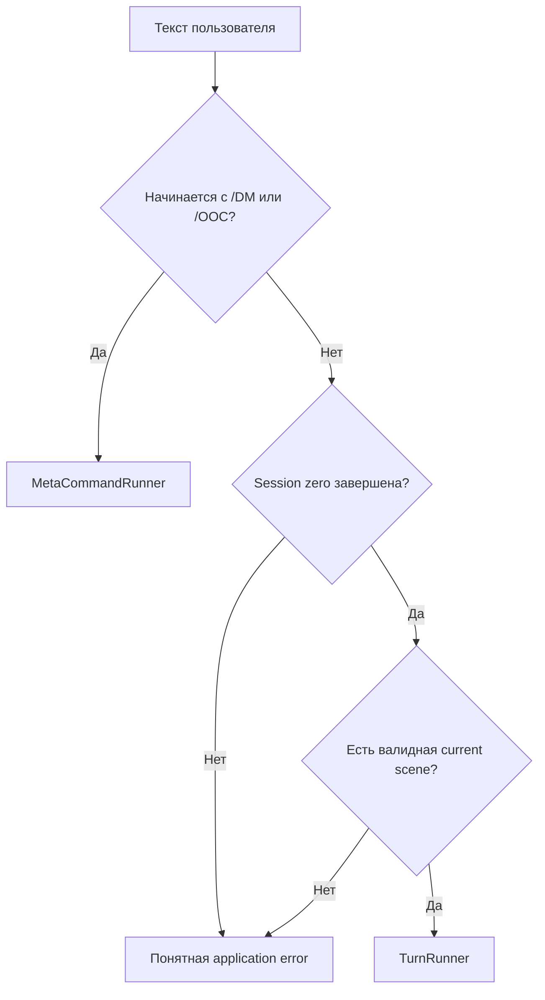
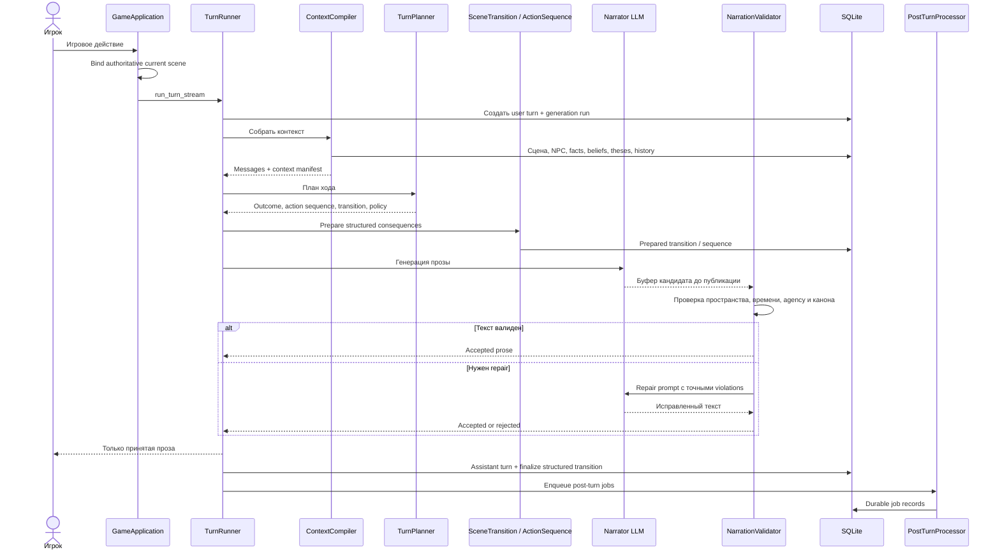
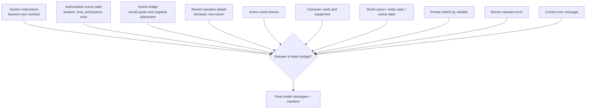
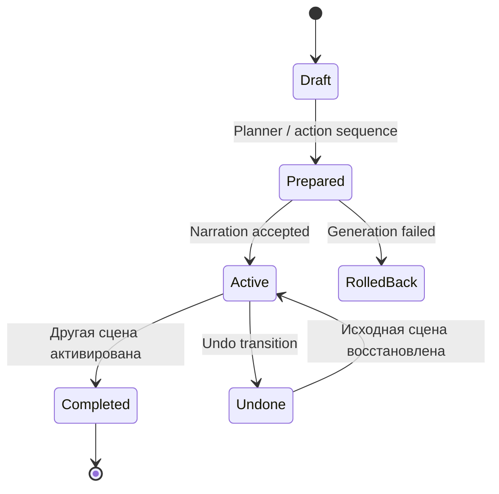
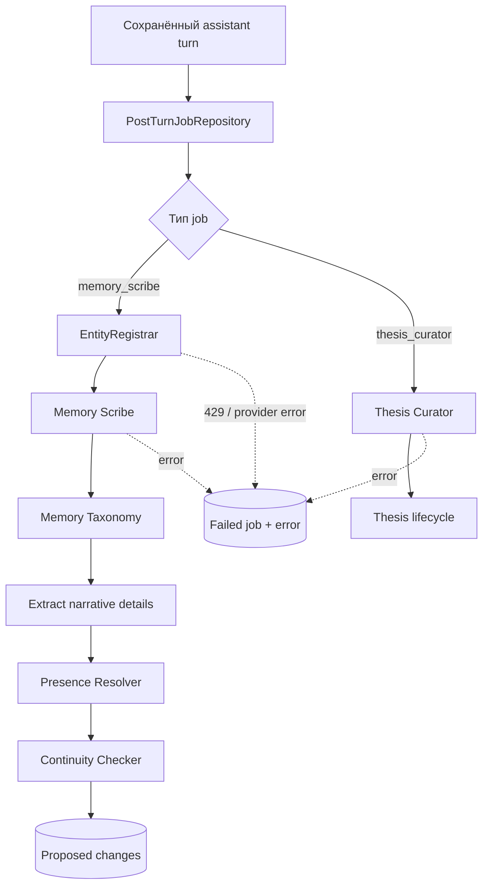
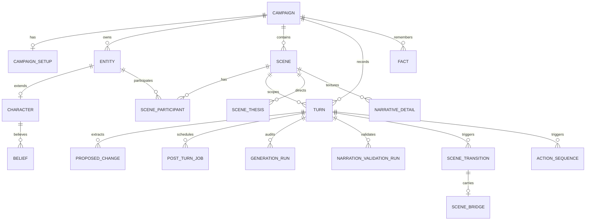

# Personal DM: архитектура движка и взаимодействие процессов

> Состояние документа: runtime-parity stabilization. CLI сейчас является основным
> пользовательским клиентом. FastAPI сохраняется как полноценный адаптер для будущего
> фронтенда. Оба используют один `GameApplication` и один runtime pipeline.

## 1. Главная идея системы

Personal DM состоит из трёх логических частей:

1. **Клиенты** принимают команды пользователя и отображают результат.
2. **Application layer** решает, какой единый сценарий приложения выполнить.
3. **Domain/runtime layer** генерирует прозу, изменяет структурный мир и обслуживает память.

Клиент не должен самостоятельно выбирать сервисы, менять таблицы или управлять
транзакциями игрового хода.

```mermaid
flowchart LR
    Player[Игрок]

    subgraph Adapters[Клиентские адаптеры]
        CLI[CLI — основной клиент сейчас]
        API[FastAPI]
        UI[Будущий web/Tauri frontend]
    end

    Runtime[install_runtime\nединая композиция guard-слоёв]
    App[GameApplication\nединая application boundary]

    subgraph Commands[Маршрутизация операций]
        Narrative[Игровой ход]
        Meta[/DM и /OOC]
        Undo[Undo]
        Admin[Сцены, NPC, участники]
        Retry[Retry post-turn]
    end

    subgraph Engine[Движок]
        Turn[Turn pipeline]
        Context[Context compiler]
        Scene[Scene lifecycle]
        Memory[Memory pipeline]
        Models[Role model router / LLM]
    end

    DB[(SQLite / SQLAlchemy)]

    Player --> CLI
    Player --> UI
    UI --> API
    CLI --> App
    API --> App
    App --> Runtime
    App --> Narrative
    App --> Meta
    App --> Undo
    App --> Admin
    App --> Retry
    Narrative --> Turn
    Turn --> Context
    Turn --> Scene
    Turn --> Models
    Turn --> Memory
    Meta --> Context
    Meta --> Models
    Undo --> Scene
    Admin --> Scene
    Retry --> Memory
    Turn --> DB
    Scene --> DB
    Memory --> DB
    Context --> DB
```

### Важный инвариант

Одинаковая команда с одинаковым состоянием кампании должна вызвать одинаковый pipeline
через CLI, FastAPI и будущий frontend. Разница допускается только в форматировании ввода
и вывода.

## 2. Единый runtime bootstrap

`app.runtime.install_runtime()` устанавливает полный набор runtime-расширений ровно один
раз независимо от entrypoint:



До стабилизации эти guard-слои включались побочным эффектом импорта `app.main`, поэтому
CLI мог работать без части движка. Теперь bootstrap вызывается через общий application
layer и напрямую каждым production entrypoint.

## 3. Нулевая сессия

Нулевая сессия — отдельный setup-процесс. До её завершения narrative turn запрещён.



### Что хранится после завершения

- договорённости о мире, жанре, тоне и границах;
- карточка героя;
- начальная локация;
- первая активная сцена;
- стартовый pinned thesis;
- session-zero contract в system instructions.

## 4. Маршрутизация пользовательского ввода

`GameApplication.route_input()` первым делом отличает meta-команду от игрового хода.



Meta-команда выполняется до session-zero gate и не запускает Planner, scene transition,
Memory Scribe или Curator. Она читает состояние кампании, но не меняет канон.

## 5. Narrative turn pipeline

Игровой ход — наиболее сложный процесс системы.



### Основные свойства

- пользовательский текст сохраняется до внешнего вызова модели;
- narration validator буферизует ответ до проверки;
- переход сцены сначала имеет состояние `prepared`;
- при отказе генерации prepared-переход компенсируется;
- ответ и generation audit сохраняются до фоновой памяти;
- сбой Scribe не уничтожает уже показанный ход.

## 6. Сборка контекста

Контекст модели собирается слоями с token budget и manifest.



Manifest записывает, какие IDs и слои реально попали в prompt. Это позволяет объяснять
ошибку не догадкой, а конкретным составом контекста.

## 7. Scene lifecycle и перемещения



`SceneLifecycleService.activate()` является владельцем active-scene pointer:

- завершает предыдущую активную сцену;
- активирует целевую;
- обновляет `campaign.current_scene_id`;
- синхронизирует локации участников;
- не позволяет NPC молча телепортироваться;
- гарантирует присутствие героя игрока.

## 8. Undo

Undo должен отменять не только текстовые turns, но и структурные последствия.

```mermaid
flowchart TD
    Undo[/undo]
    App[GameApplication.undo_last_turn]
    Service[TurnUndoService]
    Pair[Пометить user + assistant undone]
    Seq{Есть action sequence?}
    Trans{Есть scene transition?}
    Restore[Восстановить исходную сцену\nлокации и участников]
    Bridge[Пометить bridge undone]
    Commit[Одна application commit boundary]

    Undo --> App --> Service --> Pair --> Seq
    Seq -- Да --> Restore
    Seq -- Нет --> Trans
    Trans -- Да --> Restore
    Trans -- Нет --> Commit
    Restore --> Bridge --> Commit
```

## 9. Post-turn memory pipeline

После сохранения художественного ответа запускаются durable jobs.



### Классы памяти

| Класс | Назначение | Срок жизни |
|---|---|---|
| `world_canon` | Устойчивые истины мира и завершённые события | Постоянно |
| `entity_state` | Текущее состояние конкретной сущности | До замены |
| `scene_state` | Факт, истинный только внутри сцены | До закрытия сцены |
| `narrative_detail` | Жест, шум, поза, краткая атмосфера | Несколько ходов |
| `scene_thesis` | Рабочая режиссёрская память сцены | До resolution / TTL |

## 10. Обработка отказов

```mermaid
flowchart TD
    Failure{Где произошёл сбой?}
    Before[До сохранения assistant turn]
    After[После сохранения assistant turn]
    Setup[Во время session zero]
    Before --> Retry[Retry generation]
    Retry --> Exhausted{Попытки исчерпаны?}
    Exhausted -- Да --> Compensate[Rollback prepared transition\nmark generation failed]
    Exhausted -- Нет --> Continue[Продолжить генерацию]
    After --> Durable[Job status = failed\nответ остаётся активным]
    Durable --> Manual[/retry-memory или worker retry]
    Setup --> Pending[Сохранить pending user message]
    Pending --> Resume[Продолжить беседу позже]
```

## 11. Основные таблицы и связи



## 12. Ответственность компонентов

| Компонент | Что делает | Чего делать не должен |
|---|---|---|
| CLI / frontend | Ввод, меню, отображение stream | Вызывать repositories и доменные executors |
| FastAPI | HTTP validation и transport | Содержать отдельную игровую бизнес-логику |
| `GameApplication` | Маршрутизация use cases и application transactions | Формировать художественную прозу |
| `TurnRunner` | Один narrative-turn workflow | Обслуживать UI-команды и ручное администрирование |
| `ContextCompiler` | Формировать prompt и manifest | Менять состояние мира |
| `SceneLifecycleService` | Владеть active scene | Генерировать сюжет |
| `PostTurnProcessor` | Retryable memory jobs | Отменять уже опубликованный ответ |
| Repositories | Persistence primitives и flush | Самостоятельно владеть use-case транзакцией |
| Runtime guards | Временное подключение cross-cutting правил | Зависеть от случайного порядка import entrypoint |

## 13. Что ещё остаётся стабилизировать

Runtime parity — первый этап. Следующие безопасные итерации:

1. Заменить monkeypatch guards явным `GameRuntime` dependency graph.
2. Выделить Turn Saga из `TurnRunner` и дать ей одного владельца транзакций.
3. Разделить `ContextCompiler` на независимые context providers.
4. Разделить `ContinuityChecker` по типам proposed change.
5. Запретить repositories и domain services вызывать `commit()` самостоятельно.
6. При запуске проверять Alembic head вместо `Base.metadata.create_all()`.
7. Подключить будущий frontend только через FastAPI methods, которые уже используют
   `GameApplication`.

## 14. Практический путь диагностики

При ошибке игрового хода проверять в таком порядке:

1. `generation_runs` — была ли генерация и какой provider/model использовался;
2. `turn.context_snapshot` — какие слои и IDs вошли в prompt;
3. `narration_validation_runs` — был ли текст repaired или failed-open;
4. `scene_transitions` / `action_sequences` — какие структурные действия prepared;
5. `post_turn_jobs` — завершились ли Registrar, Scribe и Curator;
6. `proposed_changes` — что извлечено из ответа;
7. `facts`, `beliefs`, `scene_theses`, `narrative_details` — что реально попало в память;
8. debugger и memory-ops — нет ли orphan, expired или misclassified записей.
