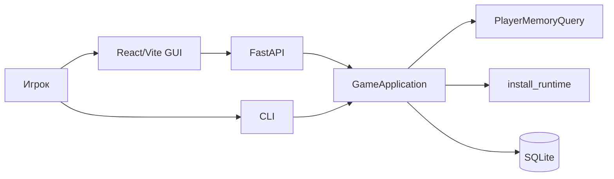
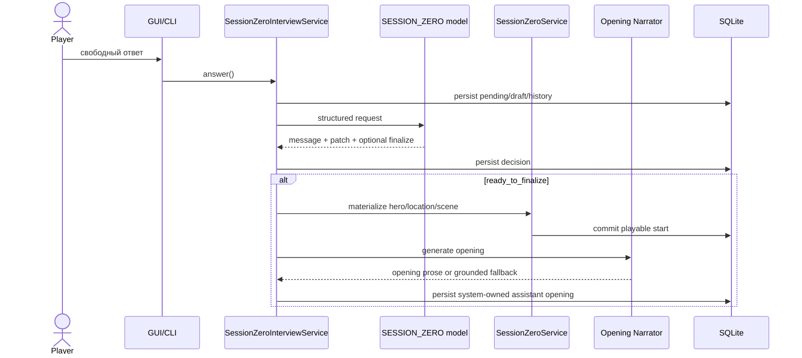
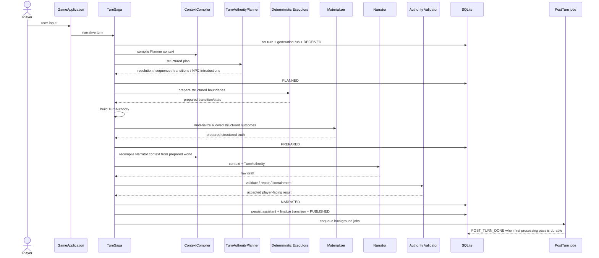

# Personal DM: текущая runtime-архитектура

**Статус:** current production overview  
**Дата:** 29 августа 2026

Этот документ описывает фактический production runtime. Детальная причинная карта и observability gaps находятся в [`../runtime-transparency.md`](../runtime-transparency.md).

## 1. Клиенты и application boundary

React/Vite GUI и CLI используют один `GameApplication` и один runtime. FastAPI — production adapter для GUI, а не отдельная версия движка.



Player-specific projections являются query services, а не отдельными subclasses application boundary. `/facts`, например, использует `PlayerMemoryQuery`, который объединяет durable facts и beliefs героя.

Клиент не должен сам менять Scene/Location/participants или обходить use-case boundary.

## 2. Runtime bootstrap

`app.runtime.install_runtime()` устанавливает только compatibility guards, чьи invariants ещё не перенесены в explicit owners.

Текущий список задаётся `runtime_manifest().guards`:

```text
actor_turn_authority
actor_memory_observability
systemless_authority
mixed_actor_response
narrator_quality_recovery
narration_failure_containment
session_zero_finalize
```

Round34 больше не является runtime monkeypatch: direct-contact contract принадлежит `TurnAuthorityPlanner`, tolerant unique location identity — `PlayerDestinationAuthorizer`.

## 3. Session Zero

Session Zero — свободный разговор с primary model, которая возвращает structured decision/patch через schema-constrained вызов.



Инварианты: narrative turn запрещён до completed setup; opening создаётся автоматически и идемпотентно; visual generation best-effort и не блокирует playable state.

## 4. Input routing

`GameApplication.route_input()` различает narrative action/dialogue, `/DM`/`/OOC` meta channel и actor-scoped talk mode. Meta path read-only и не запускает normal Planner/scene transition/memory mutation pipeline.

## 5. Narrative Turn Saga

Narrative runtime является persisted Saga, а не одной SQL-транзакцией вокруг LLM calls. Structured truth подготавливается **до prose**, чтобы Narrator видел именно тот world state, который ему разрешено описывать.



### Persisted lifecycle

```text
RECEIVED
  → PLANNED
  → PREPARED
  → NARRATED
  → PUBLISHED
  → POST_TURN_DONE
```

Если turn прекращается после `PREPARED`, но до `PUBLISHED`, Saga компенсирует prepared materialization/transition и фиксирует `COMPENSATED`.

`GenerationRun.status` и Saga phase — разные оси:

```text
status: running | completed | failed | cancelled
phase:  received | planned | prepared | narrated | published | post_turn_done | compensated
```

Например `status=failed, phase=compensated` — корректное завершённое аварийное состояние.

`generation_lifecycles` хранит phase, attempt counter и timestamps. `GenerationLifecycleRepository.list_incomplete()` обнаруживает persisted `PREPARED/NARRATED` attempts, требующие recovery decision после crash/restart.

## 6. Failure semantics

До `PREPARED` failure не должен оставлять authoritative world mutation.

После `PREPARED` и до `PUBLISHED` разрешены только два выхода:

1. accepted deterministic containment и normal publication;
2. compensation prepared effects и `COMPENSATED`.

После `PUBLISHED` memory/post-turn failures не отменяют narrative turn: background jobs остаются independently retriable.

Мы сознательно не держим SQLite transaction открытой во время долгих Planner/Narrator calls.

## 7. TurnAuthority

Один typed `TurnAuthority` — handoff между semantic control plane и presentation layer. Он содержит exact player input, actor identity, scene disposition, source/target location, present/known-absent characters, allowed new NPCs/arrivals, action sequence, resolution, observable consequences и narration constraints.

`TurnAuthorityService` является assembler. Input-routing actor resolution принадлежит `ActorResolver`, а identity/presence classification planned NPC introductions — `NpcIntroductionResolver`. Последний bulk-load'ит physical character state, поэтому authority assembly не делает N+1 `get_character()` по всему roster.

| Concern | Owner |
|---|---|
| voluntary protagonist action/dialogue | human player |
| intended resolution | Planner |
| addressed actor provenance | `ActorResolver` |
| NPC identity/arrival classification | `NpcIntroductionResolver` |
| movement/Scene/Location | deterministic executors |
| physical presence mutation | `PresenceService` |
| physical state reads/invariants | `SceneStateService` |
| allowed new NPC | Planner + deterministic materializer |
| prose/style | Narrator |
| prose acceptance/repair | Validator + deterministic guards |
| long-term memory extraction | post-turn pipeline |

## 8. ContextCompiler

Production `ContextCompiler` использует composition, а не legacy inheritance. Он объединяет три явных слоя:

1. `CoreContextCompiler` — data selection/token budgeting;
2. versioned `PromptPolicy` — narrator/player ownership contracts;
3. ordered `ContextPipeline` providers — structured scene state и transient narrative details.

Compiler собирает authoritative Scene/Location/time/participants/exits, active theses, actor-scoped cards/facts/beliefs/relationships, transient narrative details, relevant history, current input и auditable token-budget metadata. `prompt_policy_version` сохраняется в metadata каждого compiled context.

Planner context компилируется до structured execution. Если prepared state изменил scene/presence/NPC state, Narrator context компилируется повторно после materialization. Поэтому `runtime_manifest()` явно различает `compile_planner_context` и `compile_narrator_context`.

Подробности: [`context-pipeline.md`](context-pipeline.md).

## 9. Narration pipeline

```text
generate draft
→ repetition guard
→ deterministic agency checks
→ authority validator
→ optional surgical/model repair candidate
→ mandatory second validation
→ deterministic presentation containment if needed
→ publication trust boundary
```

`NarrationPublicationGuard` не доверяет rejected prose. Surgical repair helper может только создать untrusted candidate; прямой publish возможен лишь после отдельного validator pass. Иначе публикуется deterministic projection из `TurnAuthority`.

Narrator не может менять outcome, перемещать персонажей вне structured transition, создавать незапланированного физического NPC или добавлять voluntary protagonist action/thought/emotion.

## 10. Scene / Location / Presence

Scene != Location. Scene хранит активный драматический контекст; Location — физическое место/иерархия мест.

`PresenceService` — единственный implementation owner для mutations пары `SceneParticipant` + `Character.current_location_id`. Старые repository APIs `add_participant/remove_participant` оставлены только как compatibility facades и делегируют ему. `GameApplication` и `SceneLifecycleService` используют `PresenceService` напрямую.

`SceneParticipant` на completed scenes хранит historical scene roster и не удаляется при перемещении. Текущее физическое положение определяется `Character.current_location_id` и active scene. Это позволяет bridge/undo/debugger видеть, кто действительно участвовал в прошлой сцене, не принимая historical membership за текущую physical presence.

`SceneStateService` остаётся read model + invariant checker.

Основные инварианты:

- у campaign одна authoritative current Scene;
- structured active Scene, если у неё есть Location, согласована с physical state;
- player `current_location_id` совпадает с active Scene Location для structured scenes;
- movement проходит через structured authority или явную admin operation;
- historical SceneParticipant не является разрешением на физическое присутствие сейчас;
- real identity ambiguity fail-closed;
- NPC не телепортируется между Locations без structured movement.

## 11. NPC и actor turns

Actor-scoped turn использует выбранного physically-present NPC. Его контекст ограничен доступными ему знаниями.

New NPC protocol:

1. Planner создаёт typed introduction;
2. `NpcIntroductionResolver` классифицирует new identity / existing local arrival / invalid remote appearance;
3. authority разрешает introduction/arrival;
4. materializer создаёт structured character/presence;
5. Narrator рендерит уже разрешённый факт.

Generic direct contact имеет binary structured outcome: typed responder либо explicit no-contact. Positive prose с отсутствующей identity — invalid handoff.

## 12. Post-turn memory

После `PUBLISHED` создаются durable background jobs. `PostTurnDispatcher` запускает processing вне player latency path. После первой durable processing pass lifecycle переходит в `POST_TURN_DONE`; failed jobs при этом сохраняют собственный `failed/retriable` статус.

Memory failure не отменяет опубликованный narrative turn.

## 13. Undo

Undo работает по связанной user/assistant pair и восстанавливает structured consequences, а не только chat rows: active Scene, player Location, transition/bridge state, action-sequence-owned effects и materialized entities/presence.

## 14. Models

Default local split:

```text
campaign primary: gemma4:e4b
control: qwen2.5:7b
```

Primary: Narrator, Session Zero, `/DM`, Character Builder without override. Control: Planner, Narration Validator, Entity Registrar, Scribe, Curator, Evaluator, simulation Player, Scenario Builder, structured repair.

## 15. Visual runtime

ComfyUI visual generation — отдельный best-effort layer. GPU/ComfyUI failure не меняет campaign truth.

## 16. Debugging

Основные endpoints:

```text
GET /api/campaigns/{id}/debugger
GET /api/campaigns/{id}/debugger/turns/{assistant_turn_id}
GET /api/campaigns/{id}/debugger/trace
GET /api/debugger
```

Debugger показывает для generation run `status`, `phase`, `attempt`, phase timestamps и счётчик `dangerous_incomplete_generations`.

Фактический causal order:

```text
input
→ Planner context
→ Planner
→ deterministic execution
→ TurnAuthority
→ materialization
→ Narrator context
→ Narrator
→ validation/repair/containment
→ publication
→ post-turn
```

При расследовании отдельно фиксируются first wrong boundary, cascade и player-visible symptom.

## 17. Runtime parity

CLI, FastAPI/GUI и test harness должны получать одинаковую production composition. `runtime_manifest()` — auditable fingerprint для guards, context pipeline, turn pipeline, generation phases, failure semantics, narration pipeline, implementation identities и post-turn mode.

Parity tests должны падать, если entrypoint случайно запускает другой pipeline или documentation/runtime снова расходятся.

## 18. Оставшийся technical debt

1. семь compatibility guards всё ещё меняют часть public extension points; их следует продолжать переносить в explicit owners небольшими regression-backed изменениями;
2. `CoreContextCompiler` всё ещё содержит большой data-selection implementation; production больше от него не наследуется, но его внутренности стоит со временем дробить по read-model responsibilities;
3. raw `NarrationValidationRun` audit не полностью представлен в playtest trace;
4. per-turn token budget breakdown разнесён между context metadata и provider telemetry;
5. `/DM` нуждается в отдельной player-facing sanitization boundary;
6. prose-quality benchmark пока live-test discipline, а не persisted runtime metric;
7. automatic startup recovery для обнаруженных `PREPARED/NARRATED` attempts пока не выполняется сам — persisted query уже позволяет добавить его без реконструкции из логов.
